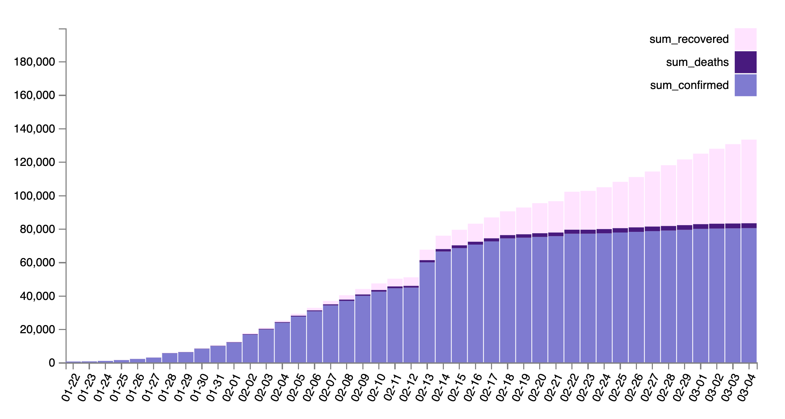
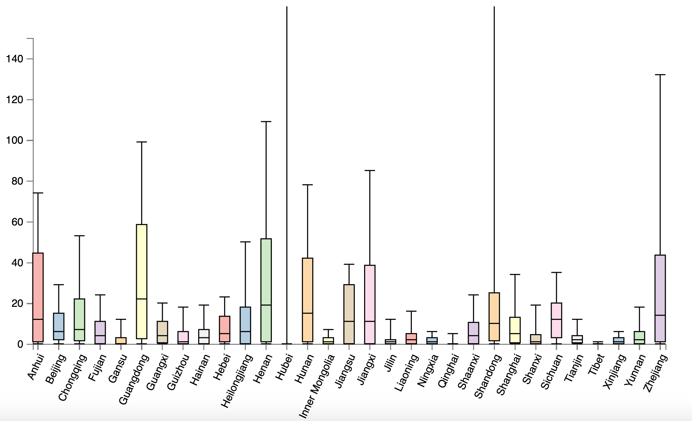
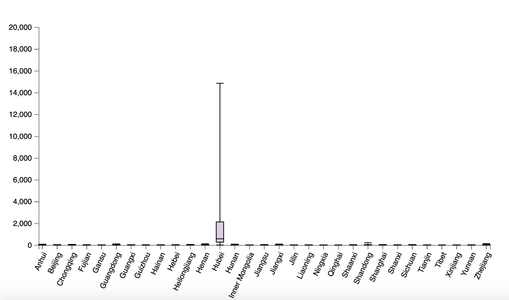

## Dataset

本次实验使用的数据集是从2020年1月2日到3月4日冠状病毒疫情数据集。数据来源 [Kaggle](https://www.kaggle.com/sudalairajkumar/novel-corona-virus-2019-dataset)，数据集描述如下：

- ObservationDate：观测时间
- Province/State：发生疫情的省份
- Country/Region：发生疫情的国家
- Confirmed：确诊病例
- Deaths：死亡病例
- Recovered：治愈病例

## Histogram

#### 实验截图

#### 数据分析

这是根据时间统计的全中国总计的确诊、死亡和治愈病例数量，需要对原数据集数据进行预处理。处理后绘制出 stacked histogram，从中可以发现：

1. 确诊病例在2月中旬前增速较快，在2月中旬后增速放缓
2. 治愈病例在2月中旬后增速加快，并逐步超过死亡病例
3. 死亡病例相对于总确诊病例的比例较为稳定

## Box Plot

#### 实验截图

