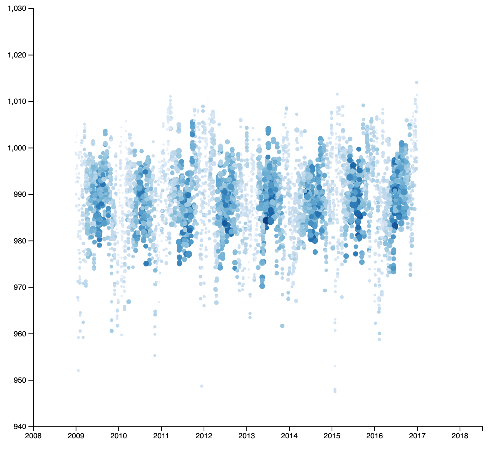
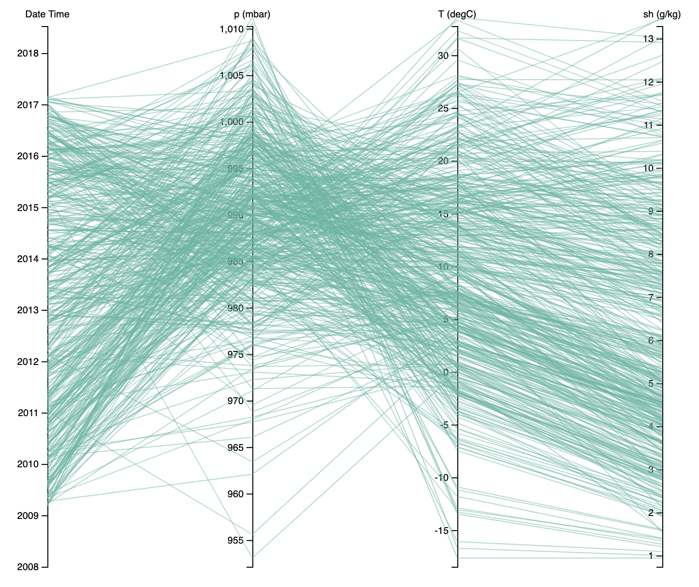

## Dataset
本次实验使用了 jena_climate_2009_2016 数据集，该数据集包含了Jena
 (德国城市) 从2009年到2016年到气候观测值。本次实验用到的相应属性为：

 - Date Time: 观测时间
 - p (mbar): 气压 (Millibar Pressure Unit)
 - T (degC): 气温 (degree Celsius)
 - sh (g/kg): 湿度

 ## Scatter Plot

### 实验截图

该散点图使用了 5,000 条观测数据，其包含了四个变量信息，分别为观测时间，气压，湿度和气温。其中观测时间作为散点图的 x 轴，气压信息作为散点图的 y 轴，气温信息用散点图中的圆点大小体现，湿度用颜色体现。

### 信息分析

可以观测到，散点图中周期性地出现颜色更深的条形状图案。这部分图案的点相对更大，颜色更深，并且大多分布于两个相邻年份的中间位置。结合现实知识，这体现了在每年的6、7、8月份，也就是每年的夏季，Jena 的空气湿度更大，气温更高。

另外可以发现颜色更深的点的大小相比颜色相比更浅的点要大。并且对于图中的点来说，颜色更深，大小更大，这两个属性大多是一并出现的。结合现实，这大致体现了当湿度更大的时候，气温相对也会更高，湿度低的时候，气温也会降低，这正是夏季和秋季的季节现象。

观察颜色更浅的点，可以发现这部分点也是聚集性分布的，并且这部分点大致分布于每年的11-2月份，也就是冬季。这部分点的另一个特征就是气压明显分布范围更广，比之夏季的气压，这部分气压分布不那么集中，总体上来看是比夏季气压略高，这可能与 Jena 的地域分布有关，其特殊的地理位置导致了其夏季气压低，冬季气压高的现象。

## Parallel Coordinates

### 实验截图

该平行坐标系图包含了 500 条观测数据，其包含了四个变量，分别为 Date Time 观测时间，气压 p (mbar)，湿度 sh(g/mg) 和气温 T (degC)。

### 信息分析

该图中可以观测到，时间的分布较均匀，气压的分布集中在 975 ~ 1010 这段范围，气温集中在 -10 ~ 30 这段范围，降水量均匀分布在 1 ~ 12 这段范围。

另外可以观测到，气压高的线更多连接到温度低的位置，气压低的连接到温度高的位置，这与散点图的观测结果一致，但是看不出气压和气温的相对分布情况。

## Comparison

对比散点图和平行坐标系，可以发现散点图图可以更好地体现变量之间的分布情况，比如气压和气温之间的关系，在散点图中可以观测到其分布的广度和范围以及对应情况，在平行坐标系中就只能观测到其范围。另外散点图中的各个变量之间的关系可以更好地观测到，比如颜色的深浅和形状的大小，颜色深的点在 x,y 轴的分布等，这些关系在平行坐标系中就很难观测到，平行坐标系可以体现相邻坐标轴间变量的联系，但若是坐标轴不相邻，便很难观测。另外在数据上，散点图可以适应的数据比平行坐标系要多，并且数据更多更能体现各个变量的分布及其之间的联系。但是平行坐标系的数据增大后，会出现分布过于密集的情况，这样便很难再去观测其分布的特征，这个问题一定程度上可以通过修改平行坐标系的线的粗细，增加其颜色深度来解决，但其表现力相较于散点图还是略有不足。

但平行坐标系的优势是其可以体现变量的定量特征，其每个坐标轴都体现了变量实际值的分布，并且可以通过增多坐标轴的数量来描述更多的变量。而散点图在处理多元变量关系时，可用的定量的维度只有两个，x轴和y轴，其余变量都是定性的体现，例如在本实验中，温度，湿度等变量都需要经过正则化后才能作为一个定性的属性呈现在散点图中，并且4个变量已经快到达散点图可以描述信息的上限了。对于多变量的数据，一个散点图可能很难将其信息全部体现出来，散点图的优势是可以更直观得观测到各个变量间的联系。

对于维度更高的数据，可以使用平行坐标系描述，可以观测到数据的定量分布情况，但这样可能在直观性上有所降低，并且较难观测到数据的分布情况。而使用散点图描述时，若是维度超过散点图可以表示信息的上限，或者其数据类型种类过多 (categorical, numerical...)，可以考虑使用降维的方式（PCA等）来将高维数据映射到低维，这样可以观测到数据的分布情况，但多元变量之间的联系会丢失。另一个使用散点图观测高维数据的方式是使用多个散点图，每个散点图中包含部分变量，但这样可能会难以观测到多个变量之间的联合分布，但联合分布可以使用降维的方式来观测，所以对于多元数据的观测，并没有对任何任务都适合的方法，但可以根据需求选择适合的方式。

