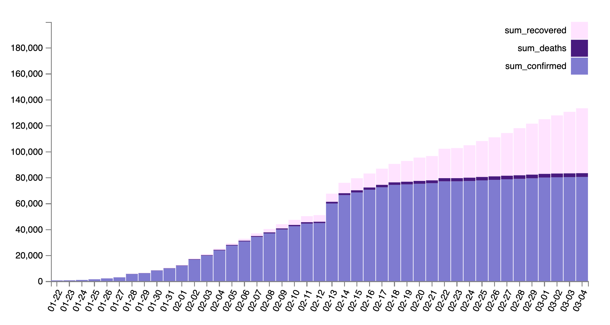
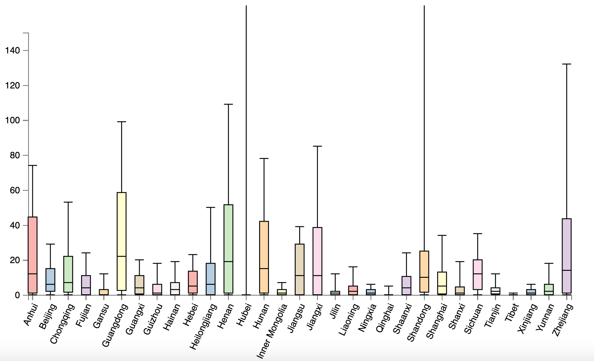
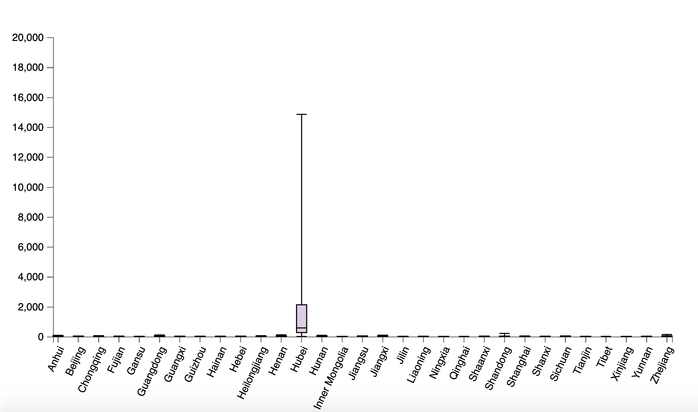

## Dataset

本次实验使用的数据集是从2020年1月2日到3月4日冠状病毒疫情数据集。数据集来源自 [Kaggle](https://www.kaggle.com/sudalairajkumar/novel-corona-virus-2019-dataset)，数据集描述如下：

- ObservationDate：观测时间
- Province/State：发生疫情的省份
- Country/Region：发生疫情的国家
- Confirmed：确诊病例
- Deaths：死亡病例
- Recovered：治愈病例

## Histogram

### 实验截图

### 数据分析

这是根据时间统计的全中国总计的确诊、死亡和治愈病例数量，需要对原数据集数据进行预处理。处理后绘制出 stacked histogram，从中可以发现：

1. 确诊病例在2月中旬前增速较快，在2月中旬后增速放缓
2. 治愈病例在2月中旬后增速加快，并逐步超过死亡病例
3. 死亡病例相对于总确诊病例的比例较为稳定

## Box Plot

### 实验截图

### 数据分析

以上为同一疫情数据的箱式图，截图一的y scale的范围为$[0,150]$，截图二的y scale范围为$[0, 20000]$。箱式图的数据为按地域分布的每天新增确诊病例，需要对数据进行预处理，处理过程见[源码](visualize.html)。从截图中可以得到以下信息：

1. 除湖北外，大部分省份的每天新增病例在20例左右，但是各省份新增的最大值却是这个值的三至四倍。可见在疫情严重时，每天新增的病例数是平时的数倍。
2. 除湖北外，安徽、江苏、广东、浙江这几个省份的新增明显比其余省份多，青海、新疆等省份新增明显较少。
3. 湖北省的新增人数远高于其他省份，且湖北省新增最多时的新增数也是其自身正常新增数目的数十倍。大部分时期湖北省每天的新增确诊人数在1000人左右。

