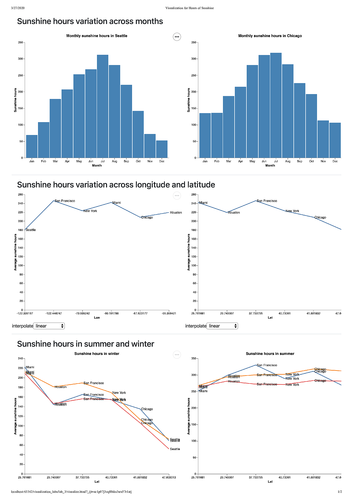

## Chart Junks

### Unintended optical arts

Excessive shading or patterning of chart features.

### Grids

 Thinning, removing, or desaturating grid lines makes it easier to see the data.

### Non-data creative graphics

These chart junks may make charts more enjoyable, more attractive, easier to remember, and easier to remember details of.

And as we go about creating your data science graphics, it's worth not only reflecting on the principles we use and the results we are sharing, but also the process by which we came up to create the graphics.

## Drawbacks in charts

#### Chart 1

在这幅图中，将死亡率与感染人数结合在一起并不好，首先图中的X轴的刻度是百分比，读者可能不清楚这个百分比指的是死亡率还是感染人数的比例，另外感染人数的分布主要集中在50岁左右的人群，而死亡率高的人群集中在高龄人群，这两者间的联系并不大，结合在一起反而会对各自的观察产生干扰。

#### Chart 2

这幅图中，将按年龄分类的流感的死亡率与冠状病毒的死亡率做对比。其中的问题有以下几个：首先流感病毒的年龄区间没有固定的长度，有的年龄段包含的年龄多，有的年龄段包含的年龄少。另外流感病毒的年龄的区间和冠状病毒的年龄区间并不对应，冠状病毒的年龄区间按 10 为长度划分，与流感病毒的年龄区间长度不对应，且其年龄区间的个数比流感病毒更多，这样不利于两者之间更精确的比较。另外这幅图中的 grid 显得有些多余，既然已经标注出每个年龄段的比例，也就没有必要再加上 y 轴的 grid ，尤其是流感病毒并没有任何一个年龄段达到了第一条 grid 的高度。另外其刻度的选择也有问题，第年龄段的死亡率过于低，这样选择的刻度导致其死亡率几乎不可观察，例如 0.06% 的死亡率与 0.02% 的死亡率在图中几乎看不出差异。

## Homework

### Dataset

Monthly Hours of Sunshine in Major U.S. Cities. It can be obtained from [here](https://observablehq.com/@uwdata/hours-of-sunshine).

#### Attributes

- **city** : The name of the city.
- **lon** : The longitude of the city.
- **lat** : The latitude of the city.
- **month** : The measured month, as a string ('Jan', 'Feb', ...).
- **monthnum** : The measured month, as a zero-based integer (0, 1, ...).
- **sunshine** : The hours of sunshine per month, averaged over 1981-2010.

### Visualization

以上图像均使用 D3 与 Vega 实现，使用 D3 处理数据，Vega 对处理后的数据作图，具体实现见 [visualize.html](visualize.html)

### Question

影响光照时长的因素有哪些？

### Analysis

上面的两张图分别为西雅图和芝加哥的光照时间随月份变化的柱状图。从图中可以观察到在七月时，光照时长达到最大，越接近七月，光照时长越长，七月后逐渐减少，减少到十二月后又逐渐增加，这也符合我们的认知，即光照时长夏季长，冬季短。另外可以发现的是西雅图在冬季的光照时长要明显少于芝加哥，在光照时长充分的夏季，这两者间的差距并不大。由这两张图可以得出的结论是月份是影响光照时长的一个因素。

中间两张图是研究了经纬度对平均光照时长的影响。左边一张是各个城市的经度与平均光照时长的折线图，观察发现这两者间没有什么联系。右边是纬度与平均光照时长的折线图，观察可以发现大致趋势为纬度越高，光照时长越少，这也符合我们的认知，即高纬度地区的光照时长要少于低纬度地区，这体现了纬度也是影响光照时长的一个因素。

从第一和第二张图中得到的一个信息是冬季各个城市间光照时长的差异大，夏季的差异较小，结合第三第四张图得到的信息，即纬度对光照时长有直接影响，我们作出最下面两张图，即夏季和冬季的三个月中，光照时长受纬度的影响。这两张折线图进一步验证了之前的想法，可以观察到冬季光照时长受纬度的影响很明显，而夏季则几乎不受影响。

